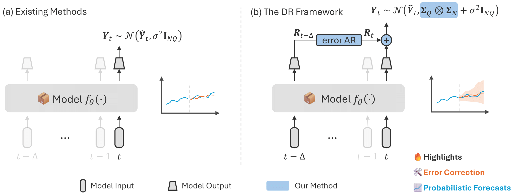

# Probabilistic Traffic Forecasting with Dynamic Regression (Transportation Science 2025)  
  


This repository contains the PyTorch implementation for the paper  
**[Probabilistic Traffic Forecasting with Dynamic Regression](https://doi.org/10.1287/trsc.2024.0560)** by [Vincent Z. Zheng](https://vincent-zheng.com/), [Seongjin Choi](https://choi-seongjin.github.io/index.html) and [Lijun Sun](https://lijunsun.github.io/), published in *Transportation Science* (2025).

<p align="center">
  
</p>

## Requirements

The code requires Python 3.10 or later. All required dependencies are listed in [requirements.txt](requirements.txt). To install them, run:

```bash
pip install -r requirements.txt
```

## Training and Evaluation

### 1. Train the Model

```bash
python src/{model_name}/train.py
```

### 2. Test the Model

```bash
python src/{model_name}/test.py
```

## Citation

If you use this code or find our work helpful, please cite:

```bibtex
@article{zheng2024probabilistic,
  title={Probabilistic Traffic Forecasting with Dynamic Regression},
  author={Zheng, Vincent Zhihao and Sun, Lijun},
  journal={Transportation Science},
  year={2024},
  publisher={INFORMS},
  doi={10.1287/trsc.2024.0560}
}
```
